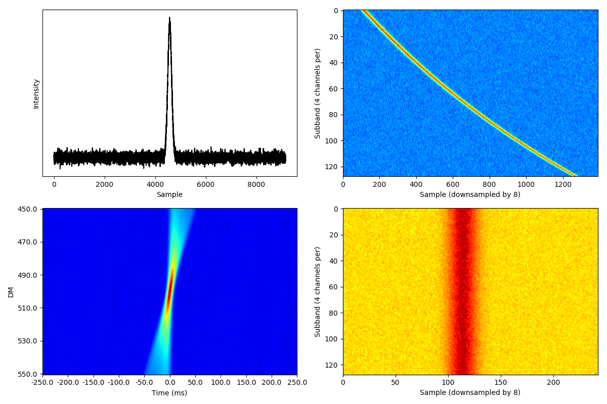

# PAFcode
Sifting and plotting single pulse candidates with a random assortment of scripts for PAF post-processing.

## Plotting and sifting

`candwrapper2020.py` is the main thing here. Running it requires only the source name, the PAF search and results directories are set as defaults so you don't have to touch those options. So running it is simply
```sh
python candwrapper.py --source <source name>
```
The wrapper finds each coincidenced candidate file of a source and the corresponding search data directory. It then goes through the candidates to see if they satisfy our search conditions (current: `S/N >= 8`, `DM >= 20`, `W < 55 ms`, `max beam distance = adjacent beams`). For successful candidates, the wrapper runs `candpanel.py` for plotting. Each plot is four panels: Dedispersed time-series, dynamic spectrum (dedispersed and non-dedispersed), and a DM-time plot ("bowtie plot"). 

 

The wrapper writes out a file called `stats.txt` for each pointing that shows the total number of candidates, how many candidates go through each sifting method, and how many candidates went through the sifting in total. All the output from the wrapper goes in a directory called `CANDS` in the same directory as the coincidenced candidate file.

The wrapper uses `binbla.py` to calculate the distance between detection beams. `beams.txt` has information on the beam pattern setup.

`candpanel.py` is an updated version of `generalplotter.py`. Running
```sh
python candpanel.py -h
```
should give you all the necessary information on how to run it. It knows the standard data parameters of the 7-beam/PAF/C+ receivers on Effelsberg set by the `--seven`/`--PAF`/`--cx` flags. To see the parameters, run
```sh
python candpanel.py --print_defaults
```

Scripts not mentioned here were used for processing of pre-2020 data, and are still here just for sentimental value and potential glossary on how to do some things.
